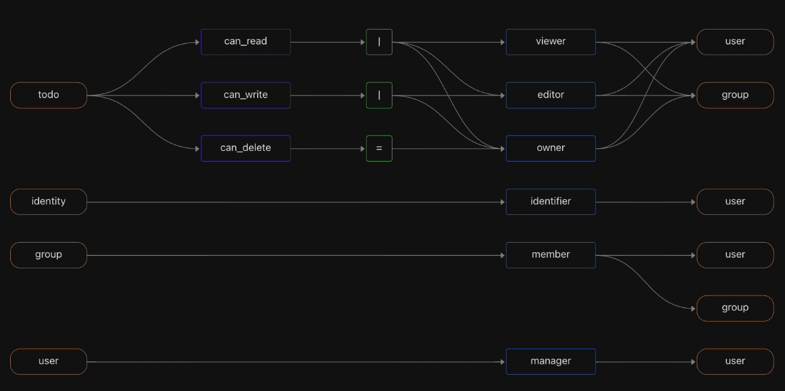

# Topaz - cloud-native authorization for modern applications and APIs

[](https://goreportcard.com/report/github.com/aserto-dev/topaz)
[](https://github.com/aserto-dev/topaz/actions/workflows/ci.yaml)


[](https://bestpractices.coreinfrastructure.org/projects/6652)
[](https://www.aserto.com/slack)
[](https://www.topaz.sh/docs/intro)
<a href="https://twitter.com/intent/follow?screen_name=aserto_com"></a>


Topaz is an open-source authorization service providing fine-grained, real-time, policy-based access control for applications and APIs.

It uses the [Open Policy Agent](https://www.openpolicyagent.org/) (OPA) as its decision engine, and provides a built-in directory that is inspired by the Google [Zanzibar](https://research.google/pubs/pub48190/) data model.

Authorization policies can leverage user attributes, group membership, application resources, and relationships between them. All data used for authorization is modeled and stored locally in an embedded database, so authorization decisions can be evaluated quickly and efficiently.



## Documentation and support

Read more at [topaz.sh](https://www.topaz.sh) and the [docs](https://www.topaz.sh/docs/intro).

Join the community [Slack channel](https://www.aserto.com/slack) for questions and help!

## Benefits

* **Authorization in one place**: a single authorization service, instead of spreading authorization logic everywhere.
* **Fine-grained**: following the Principle of Least Privilege, assign the smallest set of fine-grained permissions to each user or group.
* **Policy-based**: convert authorization "spaghetti code" into a policy expressed in its own domain-specific language, managed as code, and built into an immutable, signed artifact.
* **Real-time**: gate each protected resource with an authorization call that ensures the user has the right permission.
* **Blazing fast**: deploy the authorizer as a sidecar or microservice, right next to your app, for low latency and high availability.
* **Comprehensive decision logging**: log every decision to facilitate audit trails, compliance, and forensics.
* **Flexible authorization model**: Start simple, and grow from multi-tenant RBAC to ABAC or ReBAC, or a combination.
* **Capture your domain model**: Create object types and relationships that reflect your domain model.
* **Separation of concerns**: application developers can own the app logic, and security engineers can own the authorization policy.

## Table of Contents
- [Getting Topaz](#getting-topaz)
    - [Installation](#installation)
    - [Building from source](#building-from-source)
    - [Running with Docker](#running-with-docker)
- [Quickstart](#quickstart)
    - [Install container image](#install-topaz-authorizer-container-image)
    - [Install Todo template](#install-the-todo-template)
    - [Issue an API call](#issue-an-api-call)
    - [Issue authorization request](#issue-an-authorization-request)
    - [Run the sample application](#run-the-sample-application)
- [Command Line](#command-line-options)
- [gRPC Endpoints](#grpc-endpoints)
- [Demo video](#demo)
- [Credits](#credits)
- [Contribution Guidelines](#contribution-guidelines)

## Getting Topaz

### Installation

`topaz` is available on Linux, macOS and Windows platforms.

* Binaries for Linux, Windows and Mac are available as tarballs in the [release](https://github.com/aserto-dev/topaz/releases) page.

* Via Homebrew for macOS or LinuxBrew for Linux

   ```shell
  brew tap aserto-dev/tap && brew install aserto-dev/tap/topaz
   ```

* Via a GO install

  ```shell
  go install github.com/aserto-dev/topaz/cmd/topaz@latest
  ```

### Building from source

 `topaz` is currently using golang v1.22.* to compile, `go.mod` files are pinned to 1.21 or lower. In order to build `topaz` from source you must:

 1. Clone the repo
 2. Build and run the executable

      ```shell
      make build && ./dist/build_linux_amd64/topaz
      ```

### Running with Docker

  You can run as a Docker container:

  ```shell
  docker run -it --rm ghcr.io/aserto-dev/topaz:latest --help
  ```

## Quickstart

These instructions help you get Topaz up and running as the authorizer for a sample Todo app.

### Install Topaz authorizer container image

The Topaz authorizer is packaged as a Docker container. You can get the latest image using the following command:

```shell
topaz install
```

**NOTE:** If you get the following errors/warnings from Topaz commands:

`Cannot connect to the Docker daemon at unix:///var/run/docker.sock. Is the docker daemon running?`

Be sure to allow the default Docker socket to be used in your Docker Desktop Advanced settings.

### Install the todo template

Topaz has a set of pre-built templates that contain three types of artifacts:
* an authorization policy
* a domain model (in the form of a manifest file)
* sample data (users, groups, objects, relationships)

You can use the CLI to install the todo template:

```shell
topaz templates install todo
```

#### Artifacts

This command will install the following artifacts in `$HOME/.config/topaz/`:

```shell
tree $HOME/.config/topaz
/Users/ogazitt/.config/topaz
├── cfg
│   └── todo.yaml
├── todo
│   ├── data
│   │   ├── citadel_objects.json
│   │   ├── citadel_relations.json
│   │   ├── todo_objects.json
│   │   └── todo_relations.json
│   └── model
│       └── manifest.yaml
└── topaz.json
```
* `cfg/todo.yaml` contains a Topaz configuration file which references the sample Todo **policy image**. A policy image is an OCI image that contains an OPA policy. For the Todo template, this is the public GHCR image `ghcr.io/aserto-policies/policy-todo:latest`. The source code for the policy image can be found [here](https://github.com/aserto-templates/policy-todo/tree/main/content/src/policies).
* `todo/data/` contains the objects and relations for the Todo template - in this case, a set of 5 users and 4 groups that are based on the "Rick & Morty" cartoon.
* `todo/model/manifest.yaml` contains the manifest file which describes the domain model.

```shell
tree ~/.local/share/topaz
/Users/ogazitt/.local/share/topaz
├── certs
│   ├── gateway-ca.crt
│   ├── gateway.crt
│   ├── gateway.key
│   ├── grpc-ca.crt
│   ├── grpc.crt
│   └── grpc.key
├── db
│   └── todo.db
└── tmpl
    └── todo
        ├── data
        │   ├── citadel_objects.json
        │   ├── citadel_relations.json
        │   ├── todo_objects.json
        │   └── todo_relations.json
        └── model
            └── manifest.yaml
```

* `certs/` contains a set of generated self-signed certificates for Topaz.
* `db/todo.db` contains the embedded database which houses the model and data.
* `tmpl/todo` contains the template artifacts.

For a deeper overview of the `cfg/config.yaml` file, see [topaz configuration](https://github.com/aserto-dev/topaz/blob/main/docs/config.md).

#### What just happened?

Besides laying down the artifacts mentioned, installing the Todo template did the following things:

* started Topaz in daemon (background) mode (see `topaz start --help`).
* set the manifest found in `model/manifest.yaml` (see `topaz manifest set --help`).
* imported the objects and relations found in `data/` (see `topaz directory import --help`).
* opened a browser window to the Topaz [console](https://localhost:8080/ui/directory) (see `topaz console --help`).

Feel free to play around with the Topaz console! Or follow the next few steps to interact with the Topaz policy and authorization endpoints.

### Issue an API call

To verify that Topaz is running with the right policy image, you can issue a `curl` call to interact with the REST API.

This API call retrieves the set of policies that Topaz has loaded:

```shell
curl -k https://localhost:8383/api/v2/policies
```

### Issue an authorization request

Issue an authorization request using the `is` REST API to verify that the user Rick is allowed to GET the list of todos:

```shell
curl -k -X POST 'https://localhost:8383/api/v2/authz/is' \
-H 'Content-Type: application/json' \
-d '{
     "identity_context": {
          "type": "IDENTITY_TYPE_SUB",
          "identity": "rick@the-citadel.com"
     },
     "policy_context": {
          "path": "todoApp.GET.todos",
          "decisions": ["allowed"]
     }
}'
```

### Run the sample application

To run the sample Todo backend in the language of your choice, and see how Topaz is used to authorize requests, refer to the [docs](https://www.topaz.sh/docs/getting-started/samples).

To start an interactive session with the Topaz endpoints over gRPC, see the [gRPC endpoints](#grpc-endpoints) section.

## Command line options

```shell
topaz --help
Usage: topaz <command> [flags]

Topaz CLI

Commands:
  run                run topaz in console mode
  start              start topaz in daemon mode
  stop               stop topaz instance
  restart            restart topaz instance
  status             status of topaz daemon process
  manifest           manifest commands
  templates          template commands
  console            open console in the browser
  directory (ds)     directory commands
  authorizer (az)    authorizer commands
  config             configure topaz service
  certs              cert commands
  install            install topaz container
  uninstall          uninstall topaz container
  update             update topaz container version
  version            version information

Flags:
  -h, --help        Show context-sensitive help.
  -N, --no-check    disable local container status check ($TOPAZ_NO_CHECK)
  -L, --log         log level

Run "topaz <command> --help" for more information on a command.
```

## gRPC Endpoints

To interact with the authorizer endpoint, install [grpcui](https://github.com/fullstorydev/grpcui) or [grpcurl](https://github.com/fullstorydev/grpcurl) and point them to `localhost:8282`:

```shell
grpcui --insecure localhost:8282
```

To interact with the directory endpoint, use `localhost:9292`:

```shell
grpcui --insecure localhost:9292
```

For more information on APIs, see the [docs](https://www.topaz.sh/docs/intro).

## Demo


## Credits

Topaz uses a lot of great and amazing open source projects and libraries.

A big thank you to all of them!

## Contribution Guidelines

Topaz is a work in progress - if something is broken or there's a feature that you want, please file an issue and if so inclined submit a PR!

We welcome contributions from the community! Here are some general guidelines:

* File an issue first prior to submitting a PR!
* Ensure all exported items are properly commented
* If applicable, submit a test suite against your PR
