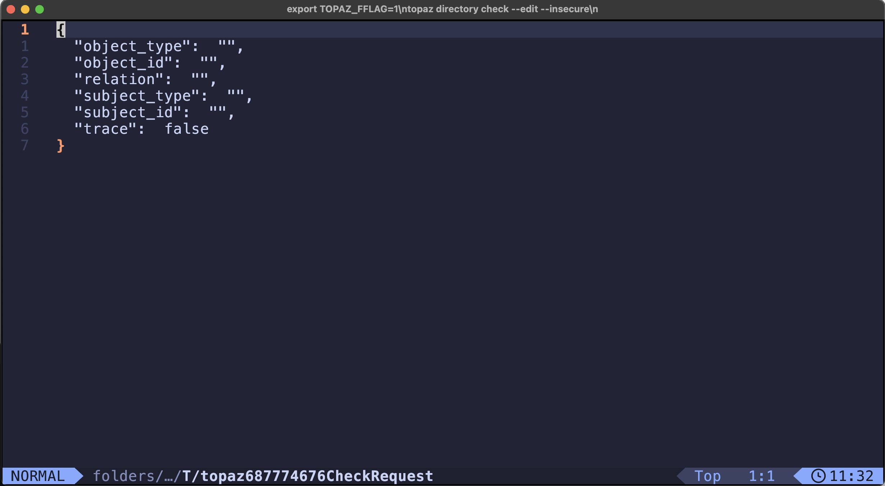
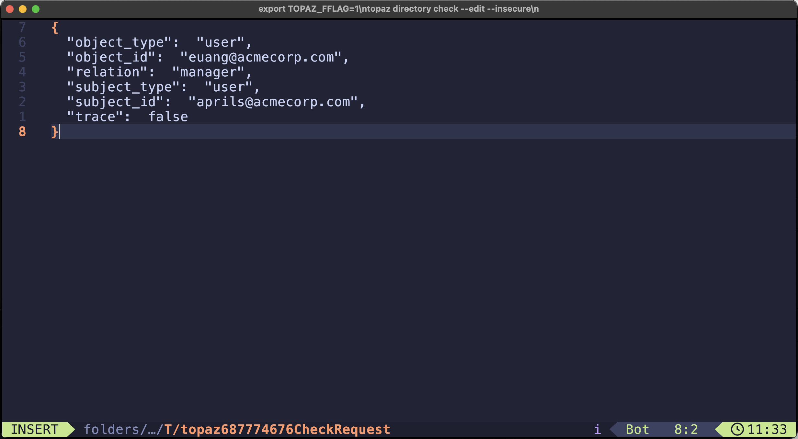

# Topaz Edit Mode

For those topaz CLI commands, that accept inline JSON request payloads, like:

```shell
topaz directory get object '{"object_type":"user", "object_id":"euang@acmecorp.com"}' --insecure
```

we have added the ability to construct these requests using a text editor.

**NOTE: these enhancements changes require topaz version `0.32.6` or higher, please check your `topaz version`**

**NOTE: to enable the new capabilities, one must set the feature flag `TOPAZ_FFLAG` environment variable to the required value.**

See [topaz feature flags](./topaz-fflag.md)

## Edit Mode

When using editor mode, the request template output, for example `topaz directory get --template` will be send to a temporary buffer and presented inside the configured editor. When saved and closed, the request will be parsed and send to the service, similar to the inline request.

When `TOPAZ_FFLAG=1` is set, the following command have the editor mode enabled:

For example:

```
export TOPAZ_FFLAG=1
topaz directory check --edit --insecure

```
Opening edit:



Finished edit:



Result:

```
{
  "check":  true,
  "trace":  []
}
```

### Edit Mode Commands

#### Directory

* `topaz directory get object [--edit | e]`
* `topaz directory set object [--edit | e]`
* `topaz directory delete object [--edit | e]`
* `topaz directory list objects [--edit | e]`
* `topaz directory get relation [--edit | e]`
* `topaz directory set relation [--edit | e]`
* `topaz directory delete relation [--edit | e]`
* `topaz directory list relations [--edit | e]`
* `topaz directory check [--edit | e]`
* `topaz directory search [--edit | e]`

#### Authorizer

* `topaz authorizer eval [--edit | e]`
* `topaz authorizer query [--edit | e]`
* `topaz authorizer decisiontree [--edit | e]`
* `topaz authorizer get-policy [--edit | e]`
* `topaz authorizer list-policies [--edit | e]`

#### Config

* `topaz config edit [ config name | `defaults` ]`(defaults to active config)

The `topaz config edit` command has been added, to allow viewing and updating configuration files.

`topaz config edit` will open the currently active configuration

`topaz config <config-name>` like `topaz config gdrive` will open the gdrive configuration file

`topaz config defaults` will open the Topaz CLI configuration file (topaz.json) which contains the default settings section.


### Setting the editor

The editor by default uses to the value of the `EDITOR` environment variable or the `TOPAZ_EDITOR` environment variable.

Example settings:

* `export TOPAZ_EDITOR=nvim`
* `export TOPAZ_EDITOR='code --watch'`
* `export TOPAZ_EDITOR=micro`

