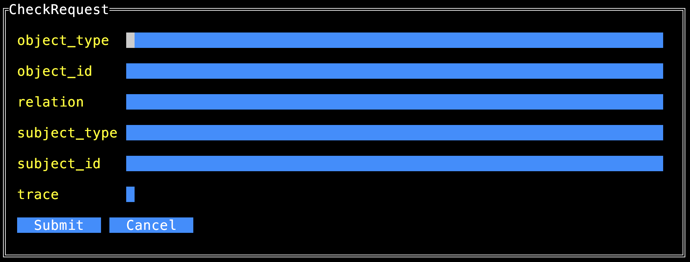

# topaz edit & prompt modes

For those topaz CLI commands, that accept inline JSON request payloads, like:

```shell
topaz directory get object '{"object_type":"user", "object_id":"euang@acmecorp.com"}' --insecure
```

we have added the ability to construct these requests using an input prompter.

**NOTE: these enhancements changes require topaz version `0.32.6` or higher, please check your `topaz version`**

**NOTE: to enable the new capabilities, one must set the feature flag `TOPAZ_FFLAG` environment variable to the required value.**

See [topaz feature flags](./topaz-fflag.md)

## Prompt Mode

When using prompt mode, an interactive TUI is presented with all the request fields and a submit and cancel button. When submitted the request is parsed and send to the service, similar to using the inline request.

When `TOPAZ_FFLAG=2` is set, the following command have the prompt mode enabled:

Directory:

* `topaz directory get object`
* `topaz directory set object`
* `topaz directory delete object`
* `topaz directory list objects`
* `topaz directory get relation`
* `topaz directory set relation`
* `topaz directory delete relation`
* `topaz directory list relations`
* `topaz directory check`
* `topaz directory search`

Authorizer:

* `topaz authorizer eval`
* `topaz authorizer query`
* `topaz authorizer decisiontree`
* `topaz authorizer get-policy`
* `topaz authorizer list-policies`

For example:

```shell
export TOPAZ_FFLAG=2
topaz directory check --insecure
```
Opening prompt:



Finished prompt:


Result:

```
topaz directory check --insecure
{
  "check":  true,
  "trace":  []
}
